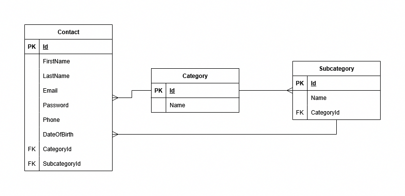
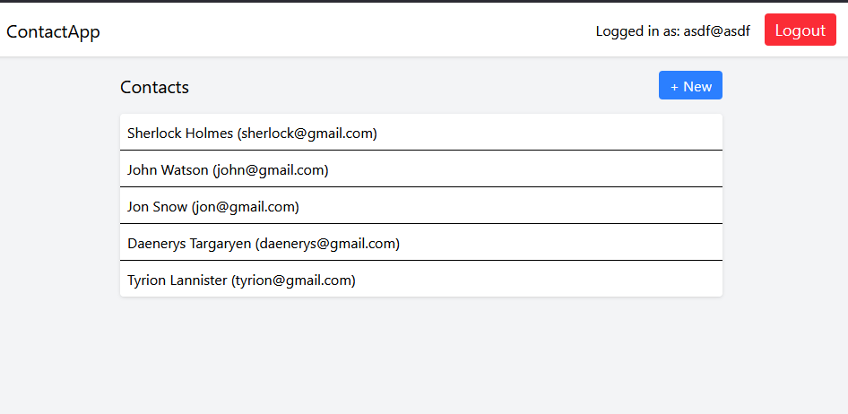
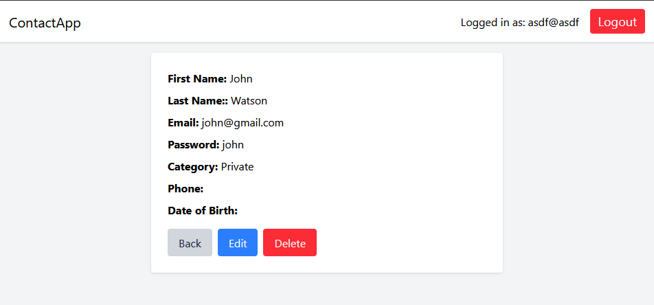
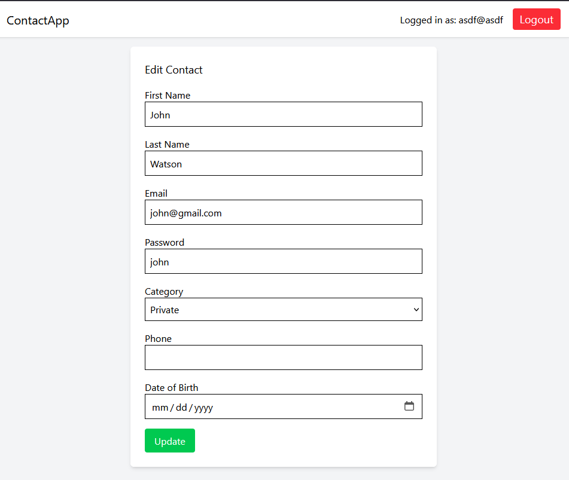

# Contacts Manager App
## Description
The backend API was written in ASP.NET with C# and SQLite. It follows REST API rules.

The frontend was written in React with Typescript and TailwindCSS.

My interpretation of the instruction:
- contacts list contains e-mail and password (I don't know why - probably a mistake in the instruction. Normally, I would remove the password from Contact as it doesn't make sense to store someone else's password)
- users created for logging in are not connected to the contact list:
    - Contacts are not owned by Users (i.e. not tied to specific user accounts).
    - Any user can edit/delete/add contacts, assuming they are logged in.
    - The contact list is shared globally, and access is managed by whether someone is logged in — not by who created what.
- unique e-mail and password requirements are implemented for users, not for contacts


## Used Nuget Packages
- Microsoft.EntityFrameworkCore.Sqlite - SQLite database (single file)
- Microsoft.EntityFrameworkCore.Tools for enabling Add-Migration and Update-Database commands
- Microsoft.AspNetCore.Authentication.Cookies - Manages HttpContext and adds SignInAsync() function
- AutoMapper.Extensions.Microsoft.DependencyInjection for DTO to object mappers

## Running

### Dependencies:
- "ASP.NET and web development" package in Visual Studio 2022 or newer
- Node.js v22 or newer (works on older probably too)

### Running:

The code was not released for production so here is how it should be  run.

Firstly, clone the repository (`git clone https://github.com/polemaster/ContactManagerApp`).

#### Backend:
 Open *ContactsManagerApp.sln* with Visual Studio and run it.

#### Frontend:
```
cd frontend
npm install
npm run dev
```
Open the displayed link after running `npm run dev` that includes *localhost*, e.g. *[localhost:5147](http://localhost:5173/)*

Note: If the port on the backend is different that *https://localhost:7149* (you can see it after running backend with Visual Studio in the Output), then change it in *frontend/vite.config.ts*.

## ERD schema of the backend




## Short backend code documentation

### Controllers

#### AuthController

Handles user authentication (register/login/logout)

Route Base: `api/auth`

Endpoints:

`GET /api/auth/me` - Returns the currently logged-in user's email (if authenticated).

`POST /api/auth/register` - Registers a new user using email and password. Automatically logs them in after creating the user.

`POST /api/auth/login` - Logs in an existing user by verifying the provided password against the stored hash.

`POST /api/auth/logout` - Logs out the currently authenticated user.

Helper function:
`SignInUser(User user)` - Creates authentication cookies for the user session.

#### CategoriesController

Provides category and subcategory listings

Route Base: `api/categories`

Endpoint: `GET /api/categories` - Returns all categories with their associated subcategories in nested format.

DTOs Used:

`CategoryWithSubsDto`: Category with a list of SubcategoryDto

`SubcategoryDto`: Represents a single subcategory

#### ContactsController

Manages CRUD operations for contacts

Route Base: `api/contacts`

Endpoints marked with [Authorize] require the user to be authenticated.

Endpoints:

`GET /api/contacts` - Returns a summary list of all contacts with basic info and category name.

`GET /api/contacts/{id}` - Returns detailed info for a single contact by ID, including category, subcategory, phone, and birthdate.

`POST /api/contacts (Authorized)` - Creates a new contact using data from a ContactCreationRequest DTO.

`PUT /api/contacts/{id} (Authorized)` - Updates an existing contact. All fields must be supplied (ContactUpdateRequest DTO).

`DELETE /api/contacts/{id} (Authorized)` - Deletes a contact by ID.


### Database context

AppDbContext — Entity Framework Database Context

Manages access to the application database using EF Core.
Includes:

- Users — For login/authentication.
- Contacts — Stores user-defined contact entries.
- Categories — Main categories (e.g. Business, Private, Other).
- Subcategories — Predefined subcategories linked to categories.

Configuration:

- Enforces unique email constraints on both Users and Contacts.
- Seeds initial data:
    - 3 base categories: Business, Private, Other
    - 3 business subcategories: Boss, Customer, Supplier

### Data models

Each model maps directly to a database table. All details are covered in the ERD.

User
- Represents an authenticated user.
- Stores email and password hash.

Contact
- Represents a saved contact.
- Linked to a category (required).
- Optionally linked to a subcategory or custom-defined "other" label.

Category
- Top-level classification for contacts.
- Can have many subcategories.

Subcategory
- Subdivision under a specific category.
- Used mainly for business-related contacts.

## App screenshots

Application home page = Contacts list:



Contact details page:



Updating contact:


